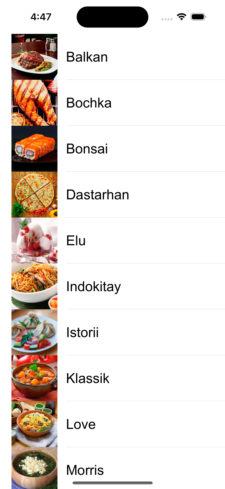

# CourseSwiftBookFull
## Full course SwiftBook
--- 

---

#### Here I go through the full course and spread the result.

In the process of learning, I use:
- UITableView
- CollectionView
- Core Data
- API
- CALayer
- Firebase
- SpriteKit
- MVC
- MVVM
- Notifacation
- Unit Testing
- CloudKit, Cloud
- SwiftUI
- SOLID, DRY, KISS, YAGNI

---

| Name                                                            | Image             |
| ----------------------------------------------------------------| :---------------: |
| UITableView        |  |

